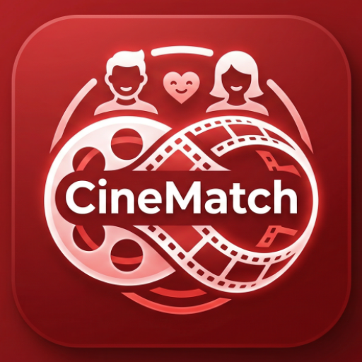

<a id="readme-top"></a>
<!-- PROJECT LOGO & HEADER -->
<br />
<div align="center">
  <a href="https://github.com/GuilhermeGraca/android-cinematch-poc">
    
  </a>
  <h3 align="center">CineMatch</h3>
  <p align="center">
    An academic project developed for the <strong>Mobile Applications Development (DAM)</strong> course at <strong>ISEL (Instituto Superior de Engenharia de Lisboa)</strong>.
    <br />
    <br />
    <a href="#about-the-project"><strong>Explore the Documentation »</strong></a>
    <br />
    <br />
    <a href="https://github.com/GuilhermeGraca/android-cinematch-poc/issues">Report Bug</a>
    &middot;
    <a href="https://github.com/GuilhermeGraca/android-cinematch-poc/issues">Request Feature</a>
  </p>
</div>

<!-- TABLE OF CONTENTS -->
<details>
  <summary>Table of Contents</summary>
  <ol>
    <li>
      <a href="#about-the-project">About The Project</a>
      <ul>
        <li><a href="#built-with">Built With</a></li>
        <li><a href="#features--key-highlights">Features & Key Highlights</a></li>
      </ul>
    </li>
    <li><a href="#lessons-learned">Lessons Learned</a></li>
    <li>
      <a href="#getting-started">Getting Started</a>
      <ul>
        <li><a href="#prerequisites">Prerequisites</a></li>
        <li><a href="#installation--running-locally">Installation & Running Locally</a></li>
      </ul>
    </li>
    <li><a href="#usage">Usage</a></li>
    <li><a href="#contact">Contact</a></li>
    <li><a href="#acknowledgments">Acknowledgments</a></li>
  </ol>
</details>

---

<!-- ABOUT THE PROJECT -->
## About The Project

> **Important Note:** This application is a Proof of Concept developed to explore and test AI tools in autonomous software engineering. Most of the codebase was autonomously generated by an AI coding agent rather than written manually.

<div align="center">


https://github.com/user-attachments/assets/f6ed25c8-0914-4269-b2e9-8d0134b9526e


  
  <br />
  <p align="center">
    <em>If the embedded video above is not displaying correctly, <a href="preview/videoDemo.mp4"><strong>click here to watch/download the video demo »</strong></a></em>
  </p>
</div>
<br />
This repository contains **CineMatch**, an academic project developed from scratch for the *Mobile Applications Development (DAM)* course at **ISEL (Instituto Superior de Engenharia de Lisboa)**.
The primary goal of this project is to explore autonomous AI-assisted development by building a native Android movie recommendation and watchlist app. It reduces decision fatigue by offering quick movie discovery via the OMDb API and offline favorites tracking.
<p align="right">(<a href="#readme-top">back to top</a>)</p>

---

### Built With
* [](https://kotlinlang.org/)
* [](https://developer.android.com/studio)
* [](https://developer.android.com/)
* [](https://developer.android.com/training/data-storage/room)
* [](https://square.github.io/retrofit/)
<p align="right">(<a href="#readme-top">back to top</a>)</p>

---

### Features & Key Highlights
* **Search and Discovery**: A home screen featuring a search bar and category chips to quickly browse and discover movies from the OMDb API.
* **Cinematic Dark Theme**: A custom dark user interface built with native XML layouts, deep gradients, and smooth micro-interactions.
* **Movie Details Screen**: Displays movie synopsis, release information, and high-quality posters loaded asynchronously.
* **Local Watchlist and Ratings**: Lets users save favorite movies offline and assign personal 0 to 5 star ratings using a local database.
<p align="right">(<a href="#readme-top">back to top</a>)</p>

---

<!-- LESSONS LEARNED -->
## Lessons Learned
* **AI-Assisted Software Engineering**: Experienced how autonomous AI coding agents can generate architecture, layouts, and logic from structured prompts.
* **MVVM and State Management**: Organized code into Model-View-ViewModel layers with Kotlin Coroutines and StateFlow for clean UI updates.
* **API Integration and Offline Persistence**: Combined Retrofit for fetching remote movie data with Room database for offline watchlist storage.
* **Android Navigation**: Used the Navigation Component with SafeArgs for reliable single-activity navigation and data passing between screens.
<p align="right">(<a href="#readme-top">back to top</a>)</p>

---

<!-- GETTING STARTED -->
## Getting Started
Follow these instructions to set up a local copy of the project on your machine.

### Prerequisites

* Android Studio (Ladybug, Meerkat, or any recent version)
* Java JDK 17 or JDK 21 configured in your IDE

### Installation & Running Locally

1. **Clone the repository**:
   ```sh
   git clone https://github.com/GuilhermeGraca/android-cinematch-poc.git
   ```
   *Windows note:* If you encounter a filename too long error during cloning, enable long paths in Git:
   ```sh
   git config --global core.longpaths true
   ```
2. **Configure your OMDb API Key**:
   Create or open the `local.properties` file in the project root directory and add your OMDb API key:
   ```properties
   OMDB_API_KEY="your_api_key_here"
   ```
3. **Open and build the project**:
   - Open the project in **Android Studio**.
   - Verify that your Gradle JDK is set to **JDK 17** or **JDK 21** under `File > Settings > Build, Execution, Deployment > Build Tools > Gradle > Gradle JDK`.
   - Click **Sync Project with Gradle Files**.
   - Click **Run 'app'** to launch the application on an Android emulator or physical device.

<p align="right">(<a href="#readme-top">back to top</a>)</p>

---

<!-- USAGE -->
## Usage
* Search for any movie title using the top search bar on the home screen.
* Tap on a movie card from the results grid to open the details view and check the synopsis and release info.
* Click the watchlist icon to save a movie locally and rate it from 0 to 5 stars.
* Access your saved movies anytime on the Watchlist tab, even without an internet connection.
<p align="right">(<a href="#readme-top">back to top</a>)</p>

---

<!-- CONTACT -->
## Contact
Guilherme Graça — [GitHub Profile](https://github.com/GuilhermeGraca)

Project Link: [https://github.com/GuilhermeGraca/android-cinematch-poc](https://github.com/GuilhermeGraca/android-cinematch-poc)
<p align="right">(<a href="#readme-top">back to top</a>)</p>

---

<!-- ACKNOWLEDGMENTS -->
## Acknowledgments
* **ISEL — Instituto Superior de Engenharia de Lisboa** for academic support and guidance.
* Course instructors of **Mobile Applications Development (DAM)**.
* [OMDb API](https://www.omdbapi.com/) for providing movie data and poster images.
* [Google Antigravity](https://deepmind.google/) for autonomous AI coding assistance.
<p align="right">(<a href="#readme-top">back to top</a>)</p>
